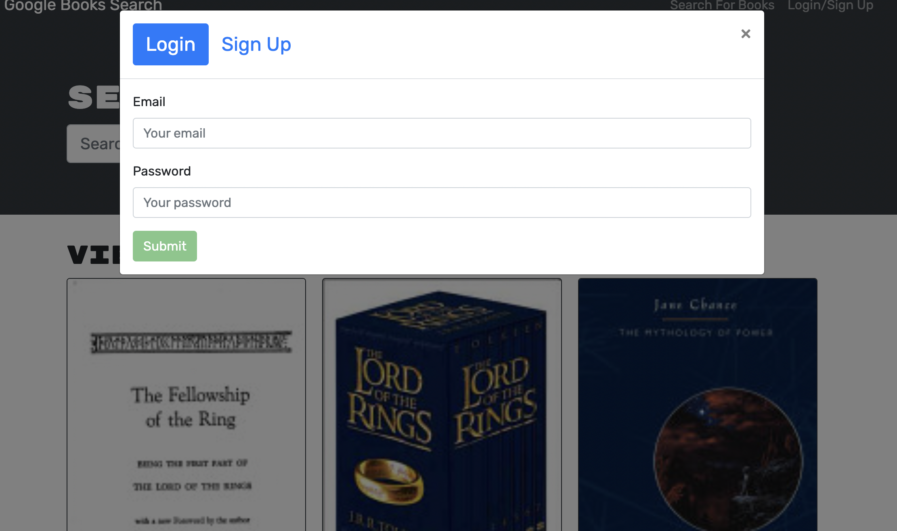

# bookSearchEngine


## Heorku Deployment

[Heroku deployment link](https://mighty-retreat-68831.herokuapp.com/)

## License 


## Description 

This is a google book search application using GraphQL API built with Apollo Server. When you search for a book, a list will be provided for you. If you are logged in, you are able to save books to you account.  





## Table of Contents 

[Installation](#Installation)


[Usage](#Usage)


[License](#License)


[Questions](#Questions)


## Installtion

The application requires GraphQl and Apollo Server. To install this application you will clone the repository to your local machine. 


## Usage 

To run the application locally run the following commands: 

Install application: ``` npm install ```

Run application: ```npm run develop```


## License 

MIT License 

## Questions 

Elia Martinez 

Email: [eliahaydeemartinez@gmail.com](eliahaydeemartinez@gmail.com)


GitHub: [Here is the link to my github page](https://github.com/EliaMart)

